# Workflow Manager

A full-stack workflow management system for Elia Group's market participant onboarding and portfolio management.

## 🏗️ Architecture Overview


## 🗂️ Monorepo Structure


## 🔄 Workflow Engine Architecture


## 🔐 Authentication & Authorization Flow


## 🛡️ Multi-Tenant Security Layers


## 💾 Database Architecture


## 🎯 Workflow State Machine


## 🔄 Workflow Execution Flow


## 🏭 Market Role Modules


## 📊 Detailed Component Interaction Sequences

### Sequence 1: Contract Onboarding - Full Flow


### Sequence 2: Data Storage Pattern - PostgreSQL vs MongoDB

```mermaid
sequenceDiagram
    participant API
    participant PG as PostgreSQL<br/>(Structured)
    participant MG as MongoDB<br/>(Flexible)

    Note over API,MG: Storing Tenant & Market Role Data

    API->>PG: INSERT INTO tenants
    Note over PG: {<br/>  id: uuid,<br/>  company_name: "Engie Belgium",<br/>  vat_number: "BE0403170701",<br/>  status: "active"<br/>}

    API->>PG: INSERT INTO tenant_market_roles
    Note over PG: {<br/>  tenant_id: uuid,<br/>  role: "BRP",<br/>  status: "onboarding",<br/>  contract_reference: "BRP-2025-001"<br/>}

    Note over API,MG: Storing Workflow Instance & State

    API->>PG: INSERT INTO workflow_instances_index
    Note over PG: Lightweight index for queries:<br/>{<br/>  id, tenant_id, mongo_id,<br/>  status, current_step,<br/>  created_at, updated_at<br/>}

    API->>MG: db.workflow_instances.insertOne()
    Note over MG: Full workflow state:<br/>{<br/>  _id: ObjectId,<br/>  tenantId: "engie-id",<br/>  marketRole: "BRP",<br/>  status: "in_progress",<br/>  currentStepId: "portfolio",<br/>  state: {<br/>    stepStates: {<br/>      "company-info": {<br/>        status: "completed",<br/>        data: {<br/>          companyName: "Engie",<br/>          vatNumber: "BE...",<br/>          address: {...}<br/>        },<br/>        completedAt: ISODate()<br/>      },<br/>      "portfolio": {<br/>        status: "in_progress",<br/>        data: {<br/>          accessPoints: [...],<br/>          deliveryPoints: [...]<br/>        }<br/>      }<br/>    },<br/>    metadata: {...}<br/>  }<br/>}

    Note over API,MG: Storing Events for Audit

    API->>MG: db.workflow_events.insertOne()
    Note over MG: Append-only event log:<br/>{<br/>  workflowInstanceId: ObjectId,<br/>  eventType: "STEP_COMPLETED",<br/>  stepId: "company-info",<br/>  eventData: {<br/>    previousState: {...},<br/>    newState: {...}<br/>  },<br/>  performedBy: "user-id",<br/>  occurredAt: ISODate()<br/>}

    Note over API,MG: Why This Split?

    Note over PG: PostgreSQL stores:<br/>• Tenants & users (relational)<br/>• Templates (versioned)<br/>• Workflow index (fast queries)<br/>• RLS enforces tenant isolation

    Note over MG: MongoDB stores:<br/>• Workflow state (nested, flexible)<br/>• Events (append-only, audit)<br/>• No schema changes needed<br/>• Fast writes for state updates
```



### Sequence 3: Query Pattern - Cross-Database Operations


### Sequence 4: Rollback Operation - Event Sourcing


## 📦 Package Dependency Graph


## 🔧 Technology Stack

| Layer | Technology | Purpose |
|-------|-----------|---------|
| **Frontend** | SvelteKit | Web framework |
| | TypeScript | Type safety |
| | TailwindCSS | Styling |
| | URQL | GraphQL client |
| | Vitest | Testing |
| **Backend** | Fastify | HTTP server |
| | Mercurius | GraphQL server |
| | TypeScript | Type safety |
| | DataLoader | N+1 optimization |
| | Zod | Validation |
| | Vitest/Jest | Testing |
| **Databases** | PostgreSQL 16+ | Structured data + RLS |
| | MongoDB 7+ | Workflow state + events |
| **Auth** | JWT | Token-based auth |
| | bcrypt | Password hashing |
| | RBAC | Role-based access |
| **DevOps** | pnpm | Package manager |
| | Turborepo | Monorepo build |
| | Docker | Containerization |
| | GitHub Actions | CI/CD |

## 🚀 Getting Started

### Prerequisites

- Node.js v22+
- pnpm v9+
- PostgreSQL 16+
- MongoDB 7+
- Docker (optional)

### Installation

```bash
# Install dependencies
pnpm install

# Set up environment
cp .env.example .env

# Run database migrations
pnpm db:migrate

# Seed test data
pnpm db:seed

# Start development servers
pnpm dev
```

### Development Commands

```bash
pnpm dev                  # Start all apps in dev mode
pnpm build                # Build all packages
pnpm test                 # Run all tests (TDD!)
pnpm lint                 # Lint all code
pnpm type-check           # TypeScript validation
```

## 📚 Documentation

- **Architecture**: See [Architecture Decision Records](./documentation/Architecture/ADRs/)
- **Development**: See [CLAUDE.md](./.claude/CLAUDE.md)
- **API**: See [GraphQL Schema](./apps/api/src/graphql/schema.graphql)

## 🧪 Test-Driven Development

This project **strictly follows TDD**:

1. **Red**: Write failing test
2. **Green**: Write code to pass test
3. **Refactor**: Improve code

```typescript
// Example: libs/workflow-engine/tests/StateMachine.test.ts
describe('StateMachine', () => {
  it('should transition to valid next step', async () => {
    // Arrange
    const machine = new StateMachine(state, template);

    // Act
    const result = await machine.transition('next-step');

    // Assert
    expect(result.success).toBe(true);
  });
});
```

## 🤝 Contributing

1. Create feature branch from `main`
2. Write tests first (TDD)
3. Implement feature
4. Ensure all tests pass
5. Create PR with conventional commit

## 📄 License

[License details]

---

**Built with ❤️ for Elia Group**
